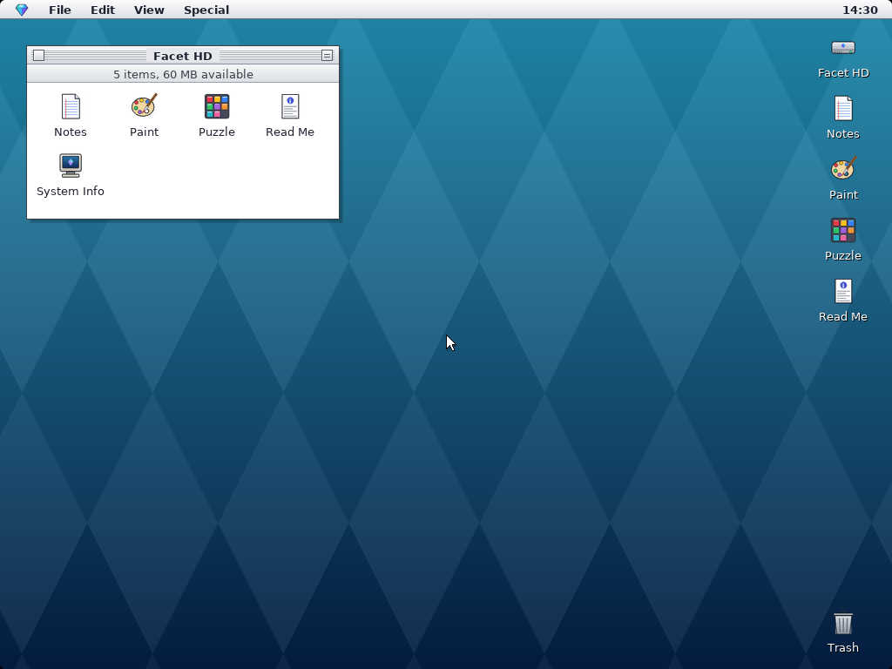
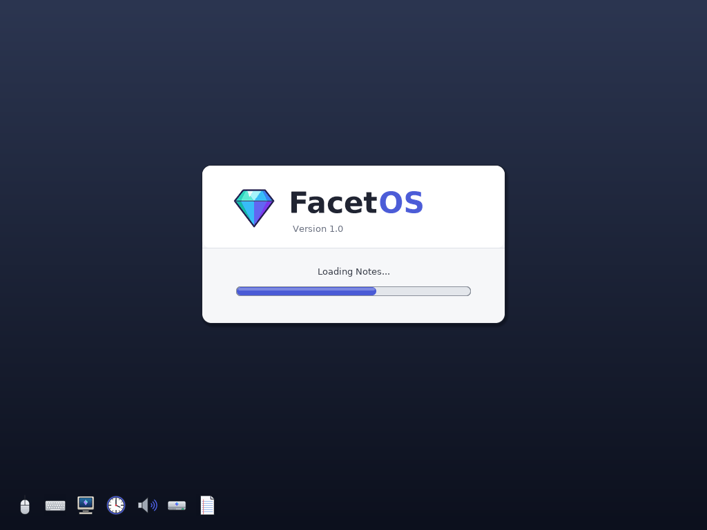
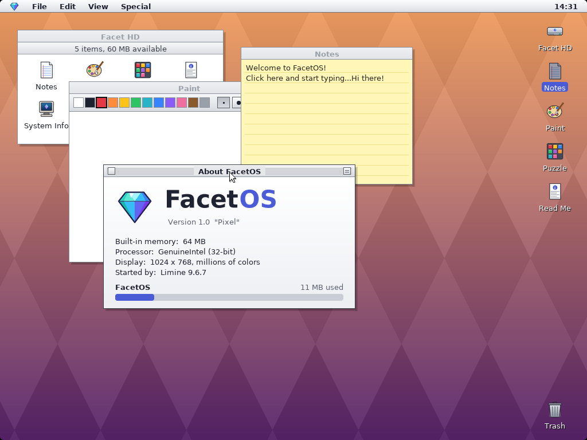

# FacetOS

**A tiny 32-bit desktop operating system that draws every pixel itself.**
No Linux, no libraries — one C file, some pixel art, and a bootloader.
Built entirely on an Android phone with Termux.



## Features

- **Boot animation** — the gem logo fades in with a startup chime, then a progress panel while each part of the system starts up
- **Classic desktop** — menu bar with a clock, striped title bars, drop shadows, desktop icons, five wallpapers
- **Window manager** — drag windows by the title bar, close box, roll-up box (or double-click a title bar)
- **Apps**
  - **About FacetOS** — real memory size, CPU vendor, screen resolution and bootloader
  - **Facet HD** — disk window with app icons
  - **Notes** — sticky-note text editor
  - **Paint** — 12 colors, 3 brush sizes
  - **Puzzle** — 15-tile sliding puzzle
  - **Read Me** and **Trash**
- **Drivers written from scratch** — PS/2 mouse and keyboard, PIT timer, CMOS clock, PC speaker
- Runs at 1024×768 in 32-bit color with anti-aliased text

| Booting | Apps |
|---|---|
|  |  |

## Try it

Download `facetos.iso` from the [Releases](../../releases) page, or build it yourself (below). Then boot it in:

- **v86** in your browser: open [copy.sh/v86](https://copy.sh/v86/), choose the ISO as the CD image, press Start
- **QEMU**: `qemu-system-x86_64 -cdrom facetos.iso -m 128`
- **VirtualBox**: new VM (Other, 32-bit), attach the ISO
- **A real PC**: write the ISO to a USB stick with Rufus or Ventoy (needs a PS/2-compatible mouse/keyboard)

## Build it

### On Android (Termux)

```bash
pkg install -y clang lld make git xorriso
git clone https://github.com/thegreatbbd94-ux/facetos.git
cd facetos
bash build.sh
```

### On Linux

Install `clang`, `lld`, `make`, `git` and `xorriso` with your package manager, then run `bash build.sh`.

The build downloads the [Limine](https://github.com/limine-bootloader/limine) bootloader automatically and produces `facetos.iso`.

## How it works

| File | What it does |
|---|---|
| `kernel.c` | The whole OS: boot entry, drivers, graphics engine, window manager, apps |
| `assets.h` | Fonts, icons and logo as data (generated by `tools/gen_assets.py`) |
| `linker.ld` | Tells the linker to load the kernel at 2 MB |
| `limine.conf` | Tells Limine to boot the kernel with the Multiboot2 protocol |
| `build.sh` | Compiles everything and makes the bootable ISO |

Boot flow: **BIOS/UEFI → Limine → Multiboot2 → `kmain()`**. Limine switches the screen into a 1024×768 graphics mode and passes its address to the kernel. From there FacetOS draws everything into a back buffer and copies only the changed parts to the screen.

To change the icons or fonts, edit `tools/gen_assets.py` and run `python3 tools/gen_assets.py` from the repo root (needs Python with Pillow and the DejaVu fonts installed).

## Roadmap

- [ ] Interrupts (IDT) instead of polling
- [ ] Paging / memory management
- [ ] Disk driver + FAT file system, so Notes and Paint can save
- [ ] Multitasking
- [ ] Loading separate app programs
- [ ] Calculator and more games

## Credits

- Bootloader: [Limine](https://github.com/limine-bootloader/limine)
- Fonts: DejaVu Sans, rasterized into bitmaps (license in `licenses/DejaVu-Fonts.txt`)
- Icons, logo and everything else: original FacetOS artwork

Licensed under the [MIT License](LICENSE).
