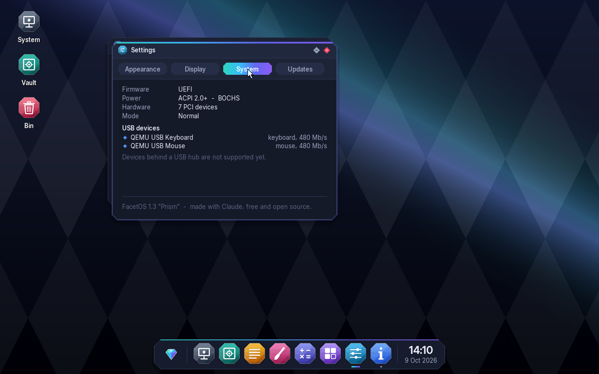
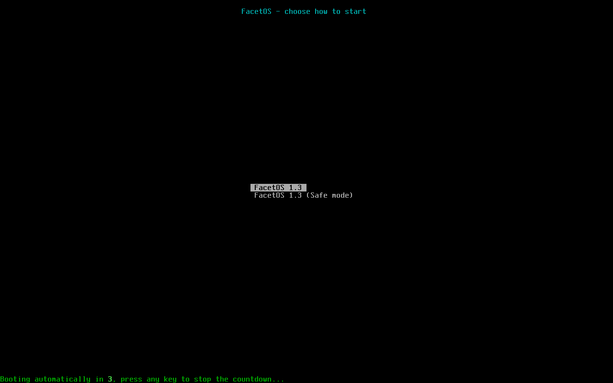

# FacetOS

**A tiny 32-bit desktop operating system that draws every pixel itself.**
No Linux, no libraries — one C file, original artwork, and a bootloader.
Designed by one person, coded with Claude, built and tested on an Android phone with Termux.


## What's new in 1.3

FacetOS now runs on modern PCs and laptops:

- **UEFI boot** — starts on modern PCs (Secure Boot must be off), and still on old BIOS PCs and in the browser
- **Any screen size** — FacetOS uses your screen's real resolution. Big screens (like 1440p and 4K) are shown at **2x** so text isn't tiny; you can switch in Settings
- **USB keyboard and mouse** — a new USB 3 (xHCI) driver, so input works even when the PC has no PS/2 emulation
- **Real power off and restart** using ACPI, the PC's own power tables
- **Settings with tabs**: Appearance, Display, System (a hardware report with your USB devices) and Updates
- **Keyboard shortcuts**: Win key opens the apps, Alt+Tab switches windows, Alt+F4 closes one
- **Boot menu with Safe mode** — 1024 x 768, no USB driver, no animations, for PCs that have trouble
- Devices placed above 4 GB of memory (common on UEFI PCs) are reached with PAE paging

| Settings: hardware report | System |
|---|---|
|  |  |

| Apps | Launcher |
|---|---|
|  |  |

| Boot: the light beam | Boot menu |
|---|---|
|  |  |

## Apps

**System** (hardware info and storage) · **Vault** (your files) · **Notes** · **Paint** · **Calculator** · **Puzzle** · **Settings** · **Read Me** · **Bin**

## Try it

Download `facetos.iso` from the [Releases](../../releases) page, or build it yourself (below). Then boot it:

- **In your browser with v86:** open [copy.sh/v86](https://copy.sh/v86/), choose `facetos.iso` as the **CD image**, press Start
- **QEMU (BIOS):** `qemu-system-x86_64 -cdrom facetos.iso -m 256`
- **QEMU (UEFI, USB):** `qemu-system-x86_64 -machine q35 -bios OVMF.fd -cdrom facetos.iso -m 256 -device qemu-xhci -device usb-kbd -device usb-mouse`
- **VirtualBox:** new VM (Other, 32-bit), attach the ISO as a CD
- **A real PC:** write the ISO to a USB stick with **Rufus** or **Ventoy** and boot from it. Turn **Secure Boot off** first. It runs as a live system; your disks are detected but never changed.

FacetOS needs about 64 MB of memory (128 MB when started with UEFI).

### On a real PC

- Plug the **USB keyboard and mouse straight into the PC** — devices behind a USB hub (or some keyboards with a built-in hub) don't work yet.
- Most **laptop touchpads** aren't USB, so use a USB mouse.
- If the screen or input misbehaves, pick **FacetOS 1.3 (Safe mode)** in the boot menu.

### Where do my files go?

- **Normally (live mode):** in the Vault, in memory, until you shut down — like a live USB.
- **If a FacetOS disk is attached** (for example a `facetos-disk.img` made with FacetOS 1.1), the Vault saves to that disk and your files survive restarts.

## Build it

### On Android (Termux)

```bash
pkg install -y clang lld make git xorriso
git clone https://github.com/YOUR-USERNAME/facetos.git
cd facetos
bash build.sh
```

### On Linux

Install `clang`, `lld`, `make`, `git` and `xorriso` with your package manager, then run `bash build.sh`.

The build downloads the [Limine](https://github.com/limine-bootloader/limine) bootloader automatically and makes `facetos.iso`, which boots on both BIOS and UEFI.

## How it works

| File | What it does |
|---|---|
| `kernel.c` | The whole OS: boot, interrupts, drivers (disk, PS/2, USB, ACPI), file system, graphics, window manager, apps |
| `assets.h` | Fonts, icons and logo as data (generated by `tools/gen_assets.py`) |
| `linker.ld` | Tells the linker to load the kernel at 2 MB |
| `limine.conf` | The boot menu: normal start and Safe mode, both using the Multiboot2 protocol |
| `build.sh` | Compiles everything and makes the bootable ISO |

Boot flow: **BIOS or UEFI → Limine → Multiboot2 → `kmain()`**. FacetOS reads the memory map, finds the ACPI tables and the framebuffer, sets up its own GDT and interrupt table, starts a 1000 Hz timer and reads the PS/2 keyboard and mouse through interrupts. It scans the PCI bus, probes the ATA drives, starts the USB 3 controller (resetting each port and asking every device what it is), and mounts the Vault. USB keyboard and mouse reports are translated into the same PS/2 codes the rest of the system already understands. Everything on screen is drawn into a back buffer and only the changed parts are copied to the screen (doubled at 2x).

To change the icons or fonts, edit `tools/gen_assets.py` and run `python3 tools/gen_assets.py` (needs Python with Pillow).

## Roadmap

- [x] Interrupts, disk driver, FAT16 file system, saving
- [x] A design language of its own ("Prism")
- [x] UEFI, any resolution, USB keyboard and mouse, ACPI power off (1.3)
- [ ] 1.4: internet through USB tethering from a phone, Ethernet, signed online updates
- [ ] 1.5: read modern disks (SATA AHCI and NVMe), FAT32
- [ ] 1.6: sound, Photos and Music apps
- [ ] USB hubs, a 64-bit version, a web browser

## Credits

- Designed by the FacetOS author, coded with Claude (Anthropic)
- Bootloader: [Limine](https://github.com/limine-bootloader/limine)
- Font: [Inter](https://rsms.me/inter/) by Rasmus Andersson (SIL Open Font License, `licenses/Inter-OFL.txt`)
- Icons, logo and everything else: original FacetOS artwork

Licensed under the [MIT License](LICENSE).
