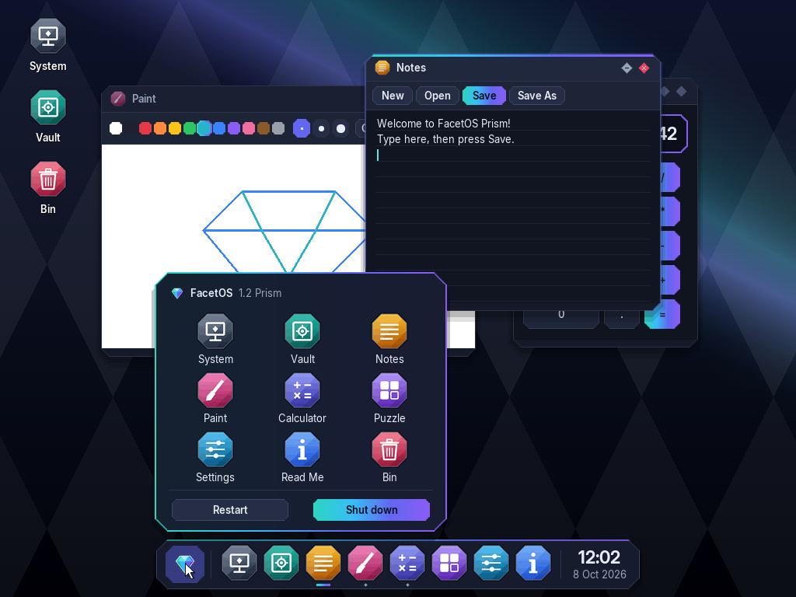
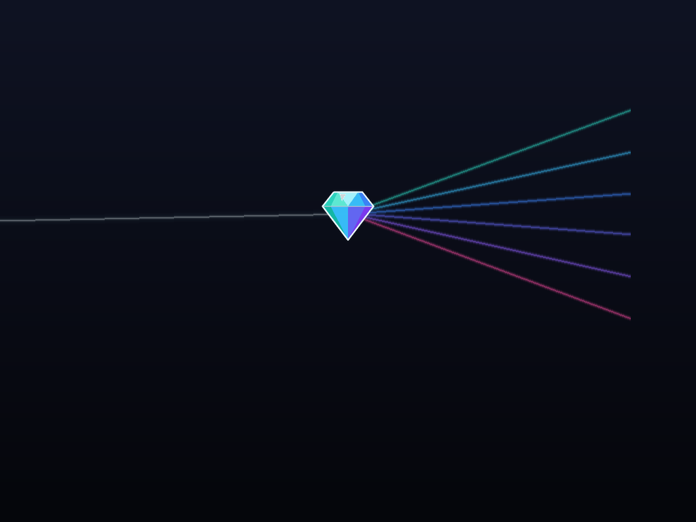
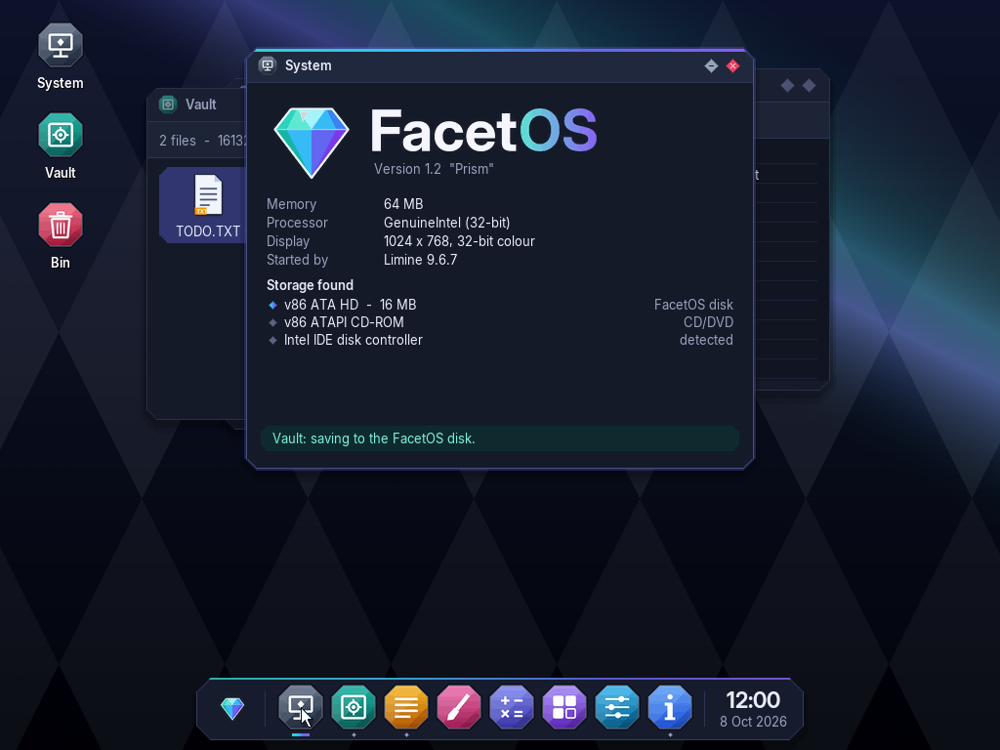

# FacetOS

**A tiny 32-bit desktop operating system that draws every pixel itself.**
No Linux, no libraries — one C file, original artwork, and a bootloader.
Designed by one person, coded with Claude, built and tested on an Android phone with Termux.


## What's new in 1.2 "Prism"

FacetOS now has a look of its own:

- **Dark glass windows with cut corners**, like the facets of a gem, and a teal-to-violet **prism accent**
- **The Prism Bar** — a floating bar at the bottom: the gem opens the app launcher, every app is one click away, and a glowing line shows which app is in front
- **Window animations** — a shimmer of light when a window opens, and the window **shatters into pieces** when you close it (can be turned off in Settings)
- **New boot animation** — a beam of light hits the gem and splits into a spectrum
- **New icons, font (Inter) and cursor**, all designed for FacetOS
- **Live mode** — FacetOS runs like a live USB: files you save go to the **Vault** and stay until you shut down
- **Hardware detection** — the System app lists the disks, CD drives, SATA/NVMe/USB controllers it finds
- **Safe by design** — FacetOS never formats or overwrites a disk. It only saves to a disk that is already a FacetOS disk

| Apps | Launcher |
|---|---|
|  |  |

| Boot: the light beam | Boot: starting up |
|---|---|
|  |  |



## Apps

**System** (hardware info and storage) · **Vault** (your files) · **Notes** · **Paint** · **Calculator** · **Puzzle** · **Settings** (wallpapers, animations) · **Read Me** · **Bin**

## Try it

Download `facetos.iso` from the [Releases](../../releases) page, or build it yourself (below). Then boot it:

- **In your browser with v86:** open [copy.sh/v86](https://copy.sh/v86/), choose `facetos.iso` as the **CD image**, press Start
- **QEMU:** `qemu-system-x86_64 -cdrom facetos.iso -m 128`
- **VirtualBox:** new VM (Other, 32-bit), attach the ISO as a CD
- **A real PC:** write the ISO to a USB stick with Rufus or Ventoy and boot from it. It runs as a live system; your disks are detected but never changed. (The mouse and keyboard need PS/2 or USB legacy support in the BIOS.)

FacetOS needs about 32 MB of memory.

### Where do my files go?

- **Normally (live mode):** in the Vault, in memory, until you shut down — like a live USB.
- **If a FacetOS disk is attached** (for example a `facetos-disk.img` made with FacetOS 1.1), the Vault saves to that disk and your files survive restarts.

## Build it

### On Android (Termux)

```bash
pkg install -y clang lld make git xorriso
git clone https://github.com/thegreatbbd94-ux/facetos.git
cd facetos
bash build.sh
```

### On Linux

Install `clang`, `lld`, `make`, `git` and `xorriso` with your package manager, then run `bash build.sh`.

The build downloads the [Limine](https://github.com/limine-bootloader/limine) bootloader automatically and makes `facetos.iso`.

## How it works

| File | What it does |
|---|---|
| `kernel.c` | The whole OS: boot, interrupts, drivers, file system, graphics, window manager, apps |
| `assets.h` | Fonts, icons and logo as data (generated by `tools/gen_assets.py`) |
| `linker.ld` | Tells the linker to load the kernel at 2 MB |
| `limine.conf` | Tells Limine to boot the kernel with the Multiboot2 protocol |
| `build.sh` | Compiles everything and makes the bootable ISO |

Boot flow: **BIOS/UEFI → Limine → Multiboot2 → `kmain()`**. FacetOS sets up its own GDT and interrupt table, starts a 1000 Hz timer, reads the PS/2 keyboard and mouse through interrupts, scans the PCI bus, probes the ATA drives, and mounts the Vault. Everything on screen is drawn into a back buffer and only the changed parts are copied to the screen.

To change the icons or fonts, edit `tools/gen_assets.py` and run `python3 tools/gen_assets.py` (needs Python with Pillow).

## Roadmap

- [x] Interrupts, disk driver, FAT16 file system, saving
- [x] A design language of its own ("Prism")
- [ ] AHCI (SATA) and NVMe drivers, to read modern disks
- [ ] USB keyboard and mouse
- [ ] Folders in the Vault
- [ ] Multitasking and separate app programs
- [ ] Games

## Credits

- Designed by the FacetOS author, coded with Claude (Anthropic)
- Bootloader: [Limine](https://github.com/limine-bootloader/limine)
- Font: [Inter](https://rsms.me/inter/) by Rasmus Andersson (SIL Open Font License, `licenses/Inter-OFL.txt`)
- Icons, logo and everything else: original FacetOS artwork

Licensed under the [MIT License](LICENSE).
