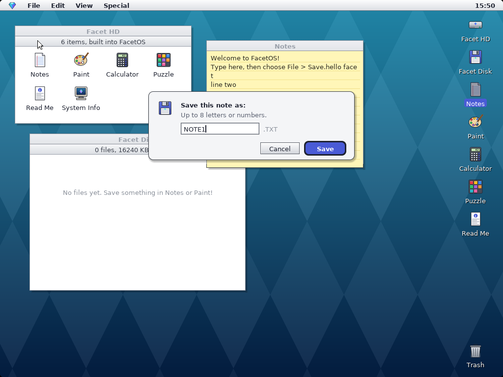

# FacetOS

**A tiny 32-bit desktop operating system that draws every pixel itself.**
No Linux, no libraries — one C file, some pixel art, and a bootloader.
Built entirely on an Android phone with Termux.


## What's new in 1.1

- **Saving files** — Notes saves `.TXT` files and Paint saves `.BMP` pictures to the **Facet Disk**
- **Facet Disk** window — see your files, double-click to open, *File > Delete File* to remove
- **Real file system** — FAT16, the same family USB sticks use, so the disk image opens on other computers too
- **Disk driver** — ATA hard disk driver written from scratch
- **Interrupts** — keyboard, mouse and timer now use interrupts, so the CPU rests when nothing happens
- **Calculator** — works with the mouse or the keyboard
- **Dialogs** — Save, Delete and error messages
- **Crash screen** — if the CPU hits an error you get a friendly message instead of a frozen screen

| Saving a note | Apps |
|---|---|
|  |  |

## Features

- **Boot animation** — the gem logo fades in with a startup chime, then a progress panel while each part of the system starts up
- **Classic desktop** — menu bar with a clock, striped title bars, drop shadows, desktop icons, five wallpapers
- **Window manager** — drag windows by the title bar, close box, roll-up box (or double-click a title bar)
- **Apps** — About FacetOS, Facet HD, Facet Disk, Notes, Paint, Calculator, Puzzle, Read Me, Trash
- **Drivers written from scratch** — PS/2 mouse and keyboard, ATA disk, PIT timer, CMOS clock, PC speaker
- Runs at 1024×768 in 32-bit color with anti-aliased text

## Try it

You need two files from the [Releases](../../releases) page (or build them yourself, below):

- `facetos.iso` — the operating system (a CD image)
- `facetos-disk.img` — the Facet Disk where your files are saved (a hard disk image)

Then boot it in:

- **v86** in your browser: open [copy.sh/v86](https://copy.sh/v86/), pick `facetos.iso` as the **CD image** and `facetos-disk.img` as the **hard disk image**, press Start. To keep your files, download the hard disk image again before closing the page (v86's "Get hard disk image" button) and use that file next time.
- **QEMU** (files are saved straight into the disk file):
  `qemu-system-x86_64 -cdrom facetos.iso -hda facetos-disk.img -boot d -m 128`
- **VirtualBox**: new VM (Other, 32-bit), attach the ISO as a CD; convert the disk with `VBoxManage convertfromraw facetos-disk.img facetos-disk.vdi` and attach it as a hard disk
- **A real PC**: write the ISO to a USB stick with Rufus or Ventoy (needs a PS/2-compatible mouse/keyboard; files can only be saved to an IDE/ATA disk)

FacetOS works without the disk too — you just can't save.

**Safety:** FacetOS only writes to a disk that is completely blank (it sets it up as a Facet Disk) or one it set up before. Any other disk is left untouched.

## Build it

### On Android (Termux)

```bash
pkg install -y clang lld make git xorriso
git clone https://github.com/thegreatbbd94-ux/facetos.git
cd facetos
bash build.sh
```

### On Linux

Install `clang`, `lld`, `make`, `git` and `xorriso` with your package manager, then run `bash build.sh`.

The build downloads the [Limine](https://github.com/limine-bootloader/limine) bootloader automatically and makes `facetos.iso`. The first time, it also makes a blank `facetos-disk.img` — later builds never overwrite it, so your saved files are safe.

## How it works

| File | What it does |
|---|---|
| `kernel.c` | The whole OS: boot, interrupts, drivers, file system, graphics, window manager, apps |
| `assets.h` | Fonts, icons and logo as data (generated by `tools/gen_assets.py`) |
| `linker.ld` | Tells the linker to load the kernel at 2 MB |
| `limine.conf` | Tells Limine to boot the kernel with the Multiboot2 protocol |
| `build.sh` | Compiles everything and makes the bootable ISO and the disk image |

Boot flow: **BIOS/UEFI → Limine → Multiboot2 → `kmain()`**. Limine switches the screen into a 1024×768 graphics mode and passes its address to the kernel. FacetOS then sets up its own GDT and interrupt table, remaps the PIC, starts a 1000 Hz timer, finds the disk and mounts the FAT16 file system. Everything on screen is drawn into a back buffer and only the changed parts are copied to the screen.

To change the icons or fonts, edit `tools/gen_assets.py` and run `python3 tools/gen_assets.py` from the repo root (needs Python with Pillow and the DejaVu fonts installed).

## Roadmap

- [x] Interrupts (IDT) instead of polling
- [x] Disk driver + FAT file system, so Notes and Paint can save
- [x] Calculator
- [ ] Folders on the Facet Disk
- [ ] Paging / memory protection
- [ ] Multitasking
- [ ] Loading separate app programs
- [ ] More games

## Credits

- Bootloader: [Limine](https://github.com/limine-bootloader/limine)
- Fonts: DejaVu Sans, rasterized into bitmaps (license in `licenses/DejaVu-Fonts.txt`)
- Icons, logo and everything else: original FacetOS artwork

Licensed under the [MIT License](LICENSE).
